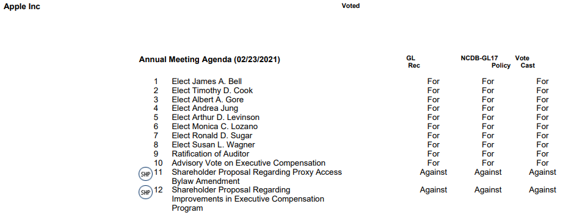

# Dataset for Glass Lewis Recommendations

### Suggested citation: 


Shu, Chong. "The Proxy Advisory Industry: Influencing and Being Influenced." <i>Journal of Financial Economics</i> 154, (2024): 103810. <a>https://www.sciencedirect.com/science/article/pii/S0304405X24000333 </a>
 
 


### 1. Download dataset

&nbsp;&nbsp;&nbsp;&nbsp; <b><a href="https://github.com/chongshu/gl_recommendations/raw/refs/heads/master/Public%20Record%20Request/processed_GL_recommendations.csv">[Download File] </a></b>


### 2. Variable definitions

<div align="center">

| Variable        | Label                                                  |
|-----------------|--------------------------------------------------------|
| `itemonagendaid`| Unique election item identifier (ISS Voting Analytics) |
| `GL_rec`        | Glass Lewis Recommendations                            |

</div>

### 3. Raw data source

Glass Lewis’s recommendations from 2008 to 2021 were obtained through a North Carolina Public Records Law request to the state's Department of State Treasurer. The request included the following information:

1. The name of the public pension fund’s proxy advisor.
2. The recommendations provided by this advisor (both generic and customized).
3. The votes cast by the fund.

The Department of State Treasurer responded with the following files: 

&nbsp;&nbsp;&nbsp;&nbsp; <b><a href="./Public Record Request">Public Record Request (2008 - 2021)</a></b>


#### Example of response


 
### 4. Match with ISS voting analytics dataset

#### Step one: matching companies

The Glass Lewis recommendations obtained through the Public Records Law request lack company identifiers such as tickers or CUSIPs, containing only company names. ISS and Glass Lewis occasionally use different names for the same company.


- For example, in ISS Voting Analytics, "Apple Inc." is used consistently throughout the sample years, while Glass Lewis referred to the company as "Apple Computer Inc." in earlier years.

To match companies between Glass Lewis recommendations and ISS Voting Analytics, the initial step involves precisely matching each company name in Glass Lewis’s recommendations to those appearing in Glass Lewis customers' N-PX forms.

- This allows for identifying the company’s ticker. An underlying assumption here is that company names in the Glass Lewis voting system remain consistent across different customers.

These tickers are then used to match companies between the Glass Lewis recommendation dataset and ISS Voting Analytics.


#### Step two: matching proposals

Matching annual meetings between Glass Lewis’s recommendations and ISS Voting Analytics requires a one-to-one correspondence between the ticker and meeting date across both datasets. 

A challenge arises in matching election items, as ISS and Glass Lewis use different styles for subitem numbers in director elections.

- For instance, at the 2013 Starbucks annual meeting, Glass Lewis assigns Howard Schultz’s election the item number “1,” while ISS labels the same election as “1a.” This discrepancy can result in numerous mismatches if matching relies solely on item numbers.

To improve matching accuracy, I implement the following steps:
 
1. When both ISS and Glass Lewis use the same style (either numeric or alphanumeric) for annual meetings, I match items based on the item number.

2. If ISS and Glass Lewis use different styles, I match proposals by sequence number, provided the total number of proposals for the annual meeting is the same in both datasets.

3. In cases where ISS and Glass Lewis use different styles and the total number of proposals for an annual meeting are different between datasets, I classify these as errors and exclude them. Of the 18,156 annual meetings in the sample, 179 instances occur where the total number of proposals differs between the two datasets.
 

### 5. Just in case you are a little geeky :>

Here are the two python functions that I use to convert the `.pdf` files from the public law request to `.csv` files of each election: `pdf_to_txt()` and `process_txt()`:
```python
def pdf_to_txt(year=2008):
    """
    convert pdf to text file
    :return  each year's pdf file e.g. 2018.pdf
    """
    pdf_file = open(r'raw_data\GL recommendations\%s.pdf' % year, 'rb')
    write_file = open(r'raw_data\GL recommendations\processed\%s.txt' % year, 'w', encoding="utf-8")
    read_pdf = PyPDF2.PdfFileReader(pdf_file)
    number_of_pages = read_pdf.getNumPages()
    for page_number in range(number_of_pages):  # use xrange in Py2
        page = read_pdf.getPage(page_number)
        page_content = page.extractText()
        write_file.write(str(page_content))
        print('(year %s) page %s out of %s' % (year, page_number, number_of_pages))
    write_file.close()

def process_txt(year=2008):
    """
    Read text file and make it into table
    :return  each year's year.csv e.g. 2018.csv
    """
    content = open(r'raw_data\GL recommendations\processed\%s.txt' % year, 'r', encoding="utf8").read()

    #  Process Company Form
    content = re.sub(r'\n(.*)\nVoted', r' -END- -START- \n\1\nVoted | ', content)
    content = re.sub(r'\n(.*)\nUnvoted', r' -END- -START- \n\1\nUnvoted | ', content)
    content = content + '-END-'
    content = re.sub(r'\n', r' ', content)
    content = re.sub('[0-9]+ of [0-9]+', '', content)  # delete page number
    content = ' '.join(content.split())  # replace multiple space to one
    
    companies = re.findall('-START-.*?-END-', content)
    print('%s of companies covered in year %s' % (len(companies), year))

    table = pd.DataFrame(columns=['company_name', 'meeting', 'date', 'item_id', 'description', 'GL_rec', 'voted'])
    i = 0
    for counter, company in enumerate(companies):
        # print(company)
        print(str(year) + ' : ' + str(counter) + '/' + str(len(companies)))
        meeting = find_between(company, '|', 'Agenda').strip()
        date = find_between(company, 'Agenda (', ') GL').strip()
        real_content = find_between(company, 'Vote Cast', '-END-').strip()  # Find content after the header
        real_content = re.sub(r'[0-9]*? Election of Directors ([0-9]*?\.1)', r'\1',
                              real_content).strip()  # delete the Election of Directors
        real_content = re.sub(r'[0-9]{1,2} Non-Voting Agenda Item', r'', real_content).strip()  # Non Vote Item
        real_content = re.sub(r'[0-9]{1,2} Non-Voting Meeting Note', r'', real_content).strip()  # Non Vote Item
        real_content = re.sub(
            r'(\b[0-9]{1,2}\.*[0-9]{0,2}(?! Year)\b(.*?)(?:Withhold|For|Against|Abstain|1 Year|2 Year|3 Year|Do Not Vote))',
            r' -end- -start- \1', real_content) + ' -end-'  # cut different proposals
        company_name = find_between(company, '-START-', '|').replace('Voted', '').replace('Unvoted', '').strip()
        voted = 1 if 'Voted' in company else 0
        proposals = re.findall(r'-start-.*?-end-', real_content)
        for proposal in proposals:
            i = i + 1
            item_id = str(re.findall(r'\b[0-9]{1,2}\.*[0-9]{0,2}\b', proposal)[0])
            description = re.findall(
                r'\b[0-9]{1,2}\.*[0-9]{0,2}(?! Year)\b(.*?)(?:Withhold|For|Against|Abstain|1 Year|2 Year|3 Year|Do Not Vote|-end-)',
                proposal)[0]
            description = ' '.join(description.split())  # replace multiple space to one
            GL_rec = get_first(
                re.findall(r'(?:Withhold|For|Against|Abstain|1 Year|2 Year|3 Year|Do Not Vote)', proposal))
            table.loc[i, 'description'] = description
            table.loc[i, 'company_name'] = company_name
            table.loc[i, 'meeting'] = meeting
            table.loc[i, 'date'] = date
            table.loc[i, 'item_id'] = ':' + item_id
            table.loc[i, 'GL_rec'] = GL_rec
            table.loc[i, 'voted'] = voted
    #     Delete duplicates
    table['item_id'] = table['item_id'].astype('str')
    table = table.drop_duplicates(['company_name', 'date', 'meeting', 'item_id', 'description', 'GL_rec'])
    table.to_csv(r'raw_data\GL recommendations\processed\%s.csv' % year, index=False)
```